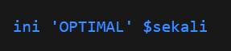
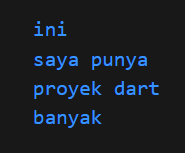

# Laporan Tugas KUIS
Nama  : Ahmad Fathan Aqil Faiq 
Kelas : 3G 
Absen : 4 
NIM   : 2141720171  

### Tugas 1 
Pada tugas 1 terdapat sintaks yang digunakan untuk menampilkan kalimat 'Hello World'.

Output :

### Tugas 2
Pada tugas 2 terdapat tipe data String yang berisi nilai dengan bentuk teks. Di bawahnya terdapat kode print('name') sebanyak tiga kali, kode tersebut akan memanggil value dari name yang telah diisi yaitu 'Ahmad Fathan Aqil Faiq' sebanyak tigas kali

Output :

### Tugas 3
Sama seperti tugas 2, tipe data String yang diberis nama firstname dan berisi nilai berupa teks 'Ahmad Fathan', di bawahnya terdapat variabel final yang diberi nama lastname dan menyimpan value 'Aqil Faiq'. Selanjutnya keduanya dipanggil melalui perintah print yang di mana mencetak satu per satu dari firstname dan lastname

Output :

### Tugas 4.1
Pada tugas 4 bagian 1, terdapat variabel array1 bertipe data final berisi data 1,2,3 dan array2 bertipe data const berisi 4,5,6. Lalu dibawahnya pada array1 dan array2 indeks ke-0 nilai nya digantu menjadi 100. Selanjutnya keduanya dicetak menggunakan print.

Tetapi akan muncul error karena jika menggunakan const maka nilainya tidak dapat diubah
Output :

Jadi solusinya tipe data const dapat diganti dengan tipe data lain seperti var.

Output :

### Tugas 4.2
Pada tugas 4 bagian 2, terdapat variabel number1 bertipe data integer berisi 100 dan variabel number2 bertipe data double bernilai 100.5. Dibawahnya kedua variabel tersebut dicetak dengan print. Tipe data int dapat menampung value bilangan bulat dan tipe data double dapat menampung bilangan desimal.

Output :

### Tugas 5
Pada tugas 5 terdapat variabel number dengan tipe data num yang berisi data 10. Lalu diganti menjadi 10.5 kemudian dicetak dengan print. Ini menunjukkan fleksibilitas tipe data num dalam Dart yang dapat digunakan untuk menyimpan nilai numerik baik integer maupun double. 

Output :

### Tugas 6
Pada tugas 6 terdapat variabel firstname berisi "Ahmad Fathan" dan lastname berisi "Aqil Faiq" dan bertipe data string. Lalu ada variabel fullName yang berisi penggabungan nilai variabel firstName dengan LastName.

Output :

### Tugas 7
Pada tugas 7 terdapat variabel text yang berisi 'ini \'OPTIMAL' \$sekali'. Ketika di print hasilnya ini 'OPTIMAL' $sekali. Penggunaan tambahan backslash yang disamakan seperti bagian dari string.

Output :

### Tugas 8
Pada tugas 8 terdapat variabel name1 yang berisi nilai variabel firstName + lastName dan name2 berisi 'Ahmad' 'Fathan' 'Aqil' 'Faiq'. Kedua variabel dicetak menggunakan print. Variabel name2 menggabungkan 4 string tanpa operator gabungan, sedangkan variabel name1 mencoba menggabungkan dua variabel saja yang sebelumnya belum.

Output :

### Tugas 9
Sama seperti tugas 8, bedanya pada variabel name1 berisi nilai variabel firstName + " " + lastName. Sehinggan hasil yang akan keluar ketika di print variable name1 tidak ada penggabungan antara satu variabel dengan yang lain.

Output ;

### Tugas 10
Pada tugas 10 terdapat penggunaan tanda kutip tiga (''') untuk membuat string multiline dalam Dart, yaitu string yang dapat mencangkup beberapa baris dimana hasilnya akan menampilkan teks dengan 4 baris.

Output :
